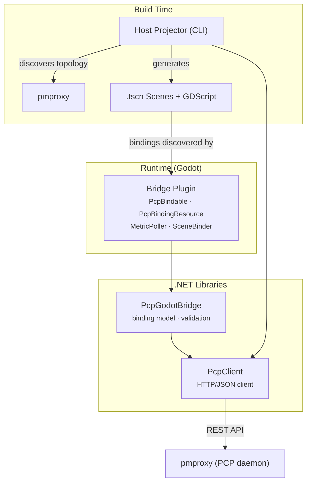

# pmview-nextgen

**Bringing Performance Monitoring to Life**

## Overview

pmview-nextgen is a next-generation performance monitoring visualization tool that represents system performance metrics as living, breathing 3D environments. Inspired by the original PCP pmview, this project aims to restore humanity to system monitoring by bridging how systems naturally behave (alive, flowing, rhythmic) with how human brains naturally comprehend (spatial, environmental, emotional).

## The Vision

> **"Make people see their system alive and say 'oh wow'"**

Current performance monitoring systems force humans to process alive, complex systems through dead, fragmented data representations (grids, charts, numbers), breaking the link between system behavior and human comprehension. pmview-nextgen transforms passive monitoring into active curiosity by encoding system performance data into 4D environments (3D + time) that humans can process naturally.

## Architecture



**Layers, from scene surface down to the wire:**

| Layer | Language | Tests | Purpose |
|-------|----------|-------|---------|
| **Host Projector** | C# (.NET 8.0) | xUnit | CLI tool: discovers host topology from pmproxy, generates .tscn scenes |
| **Scenes** | GDScript + .tscn | Godot runtime | Visual scenes with metric-driven properties |
| **Bridge Plugin** | C# (Godot.NET.Sdk) | gdUnit4 | MetricPoller, SceneBinder, PcpBindable, PcpBindingResource, editor inspector |
| **PcpGodotBridge** | C# (.NET 8.0) | xUnit | Binding model, validation, converter |
| **PcpClient** | C# (.NET 8.0) | xUnit | HTTP client for pmproxy REST API |

## Prerequisites

- [.NET 9.0+ SDK](https://dotnet.microsoft.com/download/dotnet/9.0) (the .NET 9 SDK builds our net8.0-targeted projects; Godot 4.6 requires it)
- [Godot 4.6+](https://godotengine.org/download) with .NET support (the Mono/C# flavour)
- [Performance Co-Pilot (PCP)](https://pcp.io/) with pmproxy running (for live data)
- Docker or Podman (for dev-environment stack)

## Quick Start

```bash
# Clone the repository
git clone https://github.com/tallpsmith/pmview-nextgen.git
cd pmview-nextgen

# Build and test everything (384 tests across all libraries)
dotnet build pmview-nextgen.sln
dotnet test pmview-nextgen.sln --filter "FullyQualifiedName!~Integration"

# Start the dev-environment stack (PCP + pmproxy + synthetic data)
cd dev-environment && docker compose up -d && cd ..

# Generate a host-view scene into the included Godot project
dotnet run --project src/pmview-host-projector/src/PmviewHostProjector -- \
  --pmproxy http://localhost:44322 \
  -o godot-project/scenes/host_view.tscn

# Or generate into your own Godot project:
# 1. Create the project in Godot, then Project → Tools → C# → Create C# Solution
# 2. Run the projector (builds + bundles DLLs, installs addon, patches .csproj)
dotnet run --project src/pmview-host-projector/src/PmviewHostProjector -- \
  --pmproxy http://localhost:44322 \
  --install-addon \
  -o /path/to/my-godot-project/scenes/host_view.tscn
# 3. Open in Godot, Build (Ctrl+B), enable plugin in Project Settings → Plugins

# Open the Godot project, build C# assemblies, and run the scene
dotnet build godot-project/pmview-nextgen.sln
```

## How Bindings Work

Bindings are configured directly in the Godot scene tree using custom resources — no external config files needed.

**PcpBindable** is a `Node` you attach as a child of any `Node3D`. It holds an array of **PcpBindingResource** entries, each mapping a PCP metric to a scene property:

| Field | Purpose | Example |
|-------|---------|---------|
| `MetricName` | PCP metric to fetch | `kernel.all.load` |
| `TargetProperty` | Property to drive | `height` |
| `SourceRangeMin/Max` | Expected metric value range | `0.0` — `10.0` |
| `TargetRangeMin/Max` | Mapped property range | `0.2` — `5.0` |
| `InstanceName` | Instance filter (optional) | `1 minute` |
| `InstanceId` | Instance ID filter (-1 = none) | `-1` |
| `InitialValue` | Value before first fetch | `0.0` |

At runtime, **SceneBinder** discovers all PcpBindable nodes in the scene and wires them to MetricPoller for live updates.

**Built-in property vocabulary** maps friendly names to Godot properties:

| Property | Godot Mapping | Requires |
|----------|--------------|----------|
| `height` | `Scale.Y` | Node3D |
| `width` | `Scale.X` | Node3D |
| `depth` | `Scale.Z` | Node3D |
| `scale` | uniform Scale | Node3D |
| `rotation_speed` | Y-axis rotation | Node3D |
| `position_y` | `Position.Y` | Node3D |
| `color_temperature` | HSV hue (blue→red) | MeshInstance3D + StandardMaterial3D |
| `opacity` | alpha channel | MeshInstance3D + StandardMaterial3D |

**Custom properties** pass through directly to `@export` vars on scene scripts.

## Host Projector (Scene Generator)

`pmview-host-projector` is a CLI tool that connects to a live pmproxy, discovers the host's metric topology (CPUs, disks, network interfaces, memory), and generates a complete Godot `.tscn` scene with PcpBindable bindings, layout, camera, and lighting.

The generated scene references resources from the `pmview-bridge` addon (`addons/pmview-bridge/`), so **the target Godot project must have the addon installed**. Use `--install-addon` to copy it automatically, or generate into `godot-project/` which already has it.

When using `--install-addon` with an external Godot project, the projector:
1. Builds `PcpClient.dll`, `PcpGodotBridge.dll`, and `Tomlyn.dll` from source
2. Bundles them into `addons/pmview-bridge/lib/` in the target project
3. Patches the target `.csproj` with `<Reference>` entries pointing at the bundled DLLs

**Important:** Create the C# solution in Godot first (Project → Tools → C# → Create C# Solution) so there's a `.csproj` to patch.

```bash
# Generate into the included Godot project (addon already installed)
dotnet run --project src/pmview-host-projector/src/PmviewHostProjector -- \
  --pmproxy http://localhost:44322 \
  -o godot-project/scenes/host_view.tscn

# Generate into your own Godot project (builds DLLs, installs addon, patches .csproj)
dotnet run --project src/pmview-host-projector/src/PmviewHostProjector -- \
  --pmproxy http://myserver:44322 \
  --install-addon \
  -o /path/to/my-godot-project/scenes/host_view.tscn
```

The generated scene includes 8 metric zones:

| Zone | Row | Metrics |
|------|-----|---------|
| Disk | Foreground | Read/Write bytes (cylinders) |
| Load | Foreground | 1/5/15 minute load averages (bars) |
| Memory | Foreground | Used/Cached/Buffers (bars, auto-ranged to physical RAM) |
| CPU | Foreground | User/Sys/Nice (bars) |
| Per-CPU | Background | User/Sys/Nice per CPU core (grid) |
| Per-Disk | Background | Read/Write per device (grid) |
| Network In | Background | Bytes/Packets/Errors per interface (grid) |
| Network Out | Background | Bytes/Packets/Errors per interface (grid) |

## Project Structure

```
pmview-nextgen/
├── pmview-nextgen.sln                  # Root solution (all .NET projects)
├── src/
│   ├── pcp-client-dotnet/              # PcpClient: pmproxy HTTP/JSON client
│   │   ├── src/PcpClient/
│   │   └── tests/PcpClient.Tests/
│   ├── pcp-godot-bridge/               # PcpGodotBridge: binding model + validation
│   │   ├── src/PcpGodotBridge/
│   │   └── tests/PcpGodotBridge.Tests/
│   └── pmview-host-projector/          # Host Projector: topology → .tscn generator
│       ├── src/PmviewHostProjector/
│       └── tests/PmviewHostProjector.Tests/
├── godot-project/                      # Godot 4.4 project
│   ├── addons/pmview-bridge/           # Self-contained addon (copy this dir to install)
│   │   ├── *.cs                        # Bridge plugin (Poller, Binder, Bindable, Inspector)
│   │   ├── lib/                        # Bundled DLLs (built by projector --install-addon)
│   │   └── building_blocks/            # GroundedBar/Cylinder, GridLayout3D, ZoneLabel
│   ├── scenes/                         # .tscn scene files
│   ├── scripts/
│   │   └── scenes/                     # Scene controllers (GDScript)
│   ├── test/                           # gdUnit4 tests
│   ├── pmview-nextgen.csproj           # Godot C# project
│   └── pmview-nextgen.sln              # Godot solution (includes bridge plugin refs)
├── dev-environment/                    # Docker compose: PCP + pmproxy + synthetic data
├── prototypes/                         # Spike prototypes (validated, archived)
├── specs/                              # Feature specifications
└── docs/                              # Design documents and plans
```

## Dev Environment

For live metric data, run the PCP stack with docker compose:

```bash
cd dev-environment
docker compose up -d
```

This provides a pmproxy endpoint at `http://localhost:44322` that serves synthetic metric data for development.

## Example Visualizations

- **CPU Load Bars**: 3 vertical bars showing 1/5/15 minute load averages
- **Disk I/O Panel**: Spinning cubes for reads, flat blocks for writes, per-device
- **Host View** (generated): Full system overview with CPU, memory, disk, load, and network zones

## Core Philosophy

- **Systems are already alive** — they react, flow, have rhythms, respond to stimulus
- **Humans are optimized for spatial/environmental pattern recognition** — not data grids
- **Transform passive monitoring into active curiosity** — make people curious about their data
- **Bring people together** — technical and non-technical united through shared wonder
- **Augment, don't replace** — complement existing monitoring with team culture fun

## Heritage

This project modernizes the original [PCP pmview](https://pcp.io/) tool, which visualized system metrics as 3D shapes (colored cylinders for disks, cubes for CPU/Memory/Load). pmview-nextgen takes this concept to the next level with game-like, living, breathing worlds.

## License

TBD - Exploring open source and potential dual licensing options

## Contact

Paul Smith - Project Creator
