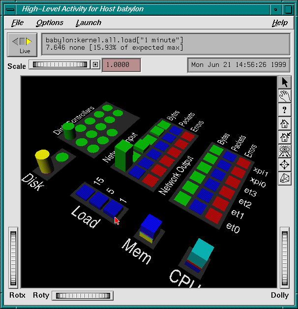
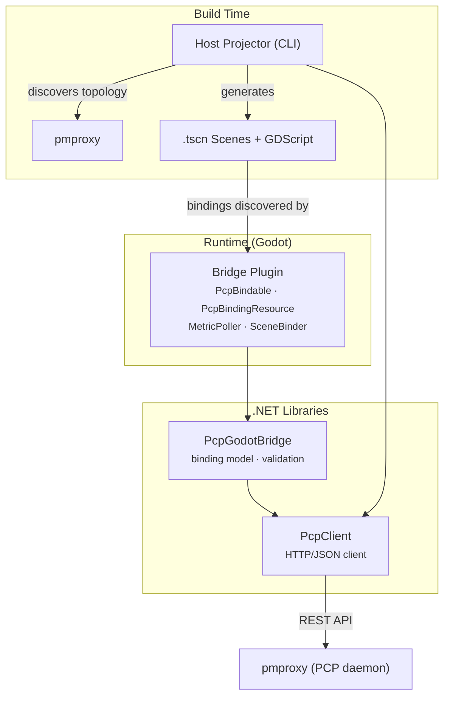

# pmview-nextgen

**Bringing Performance Monitoring to Life**

## Overview

pmview-nextgen is a next-generation performance monitoring visualization tool that represents system performance metrics as living, breathing 3D environments. Inspired by the original PCP pmview, this project aims to restore humanity to system monitoring by bridging how systems naturally behave (alive, flowing, rhythmic) with how human brains naturally comprehend (spatial, environmental, emotional).

<table>
<tr>
<td align="center" width="50%">
<strong>pmview classic (1999)</strong><br/>

<br/><em>The original — Motif widgets, OpenGL, and pure 90s energy</em>
</td>
<td align="center" width="50%">
<strong>pmview-nextgen (2026)</strong><br/>

<br/><em>Same spirit, new engine — Godot 4.6, real-time 3D, living worlds</em>
</td>
</tr>
</table>

## Download

Pre-built binaries are available from the [latest GitHub Release](https://github.com/tallpsmith/pmview-nextgen/releases/latest).

| Platform | Architecture | Download |
|----------|-------------|----------|
| macOS | Universal (Intel + Apple Silicon) | `pmview-<version>-macos-universal.dmg` |
| Linux | x86_64 | `pmview-<version>-linux-x64.tar.gz` |
| Linux | ARM64 | `pmview-<version>-linux-arm64.tar.gz` |

### macOS

1. Download the `.dmg` file
2. Mount it (double-click)
3. Drag `pmview.app` to your Applications folder (or wherever you like)
4. **First launch:** macOS will show an "unidentified developer" warning. Right-click the app → Open, then click Open in the dialog. This is only needed once.

### Linux

1. Download the `.tar.gz` for your architecture
2. Extract: `tar xzf pmview-<version>-linux-<arch>.tar.gz`
3. Run the binary:
   - **x86_64:** `chmod +x pmview.x86_64 && ./pmview.x86_64`
   - **ARM64:** `chmod +x pmview.arm64 && ./pmview.arm64`

### Build from source

If you have the .NET 10+ SDK and Godot 4.6+ installed, you can build from source — see [Quick Start](#quick-start) below.

## The Vision

> **"Make people see their system alive and say 'oh wow'"**

Current performance monitoring systems force humans to process alive, complex systems through dead, fragmented data representations (grids, charts, numbers), breaking the link between system behavior and human comprehension. pmview-nextgen transforms passive monitoring into active curiosity by encoding system performance data into 4D environments (3D + time) that humans can process naturally.

## Architecture



**Layers, from scene surface down to the wire:**

| Layer | Language | Tests | Purpose |
|-------|----------|-------|---------|
| **Host Projector** | C# (.NET 8.0) | xUnit | CLI tool: discovers host topology from pmproxy, generates .tscn scenes |
| **Scenes** | GDScript + .tscn | Godot runtime | Visual scenes with metric-driven properties |
| **Bridge Plugin** | C# (Godot.NET.Sdk) | gdUnit4 | MetricPoller, SceneBinder, PcpBindable, PcpBindingResource, editor inspector |
| **PcpGodotBridge** | C# (.NET 8.0) | xUnit | Binding model, validation, converter |
| **PcpClient** | C# (.NET 8.0) | xUnit | HTTP client for pmproxy REST API |

## Prerequisites

- [.NET 10.0+ SDK](https://dotnet.microsoft.com/download/dotnet/10.0) (builds net8.0-targeted Godot libraries and net10.0 CLI/tests)
- [Godot 4.6+](https://godotengine.org/download) with .NET support (the Mono/C# flavour)
- [Performance Co-Pilot (PCP)](https://pcp.io/) with pmproxy running (for live data)
- Docker or Podman (for dev-environment stack)

## Quick Start

```bash
# Clone the repository
git clone https://github.com/tallpsmith/pmview-nextgen.git
cd pmview-nextgen

# Build and test everything (~474 tests across all libraries)
dotnet build pmview-nextgen.sln
dotnet test pmview-nextgen.sln --filter "FullyQualifiedName!~Integration"

# Start the dev-environment stack (PCP + pmproxy + synthetic data)
cd dev-environment && docker compose up -d && cd ..

# Scaffold a new Godot project + generate a host-view scene in one command:
dotnet run --project src/pmview-host-projector/src/PmviewHostProjector -- \
  --init --pmproxy http://localhost:44322 \
  -o /path/to/my-new-project/scenes/host_view.tscn
# Open in Godot, Build (Ctrl+B), and hit Play

# Or scaffold the project first, then generate scenes into it:
dotnet run --project src/pmview-host-projector/src/PmviewHostProjector -- \
  init /path/to/my-new-project
dotnet run --project src/pmview-host-projector/src/PmviewHostProjector -- \
  --pmproxy http://localhost:44322 \
  -o /path/to/my-new-project/scenes/host_view.tscn

# Build the addon C# (addon development workspace)
dotnet build src/pmview-bridge-addon/pmview-nextgen.sln
```

## How Bindings Work

Bindings are configured directly in the Godot scene tree using custom resources — no external config files needed.

**PcpBindable** is a `Node` you attach as a child of any `Node3D`. It holds an array of **PcpBindingResource** entries, each mapping a PCP metric to a scene property:

| Field | Purpose | Example |
|-------|---------|---------|
| `MetricName` | PCP metric to fetch | `kernel.all.load` |
| `TargetProperty` | Property to drive | `height` |
| `SourceRangeMin/Max` | Expected metric value range | `0.0` — `10.0` |
| `TargetRangeMin/Max` | Mapped property range | `0.2` — `5.0` |
| `InstanceName` | Instance filter (optional) | `1 minute` |
| `InstanceId` | Instance ID filter (-1 = none) | `-1` |
| `InitialValue` | Value before first fetch | `0.0` |

At runtime, **SceneBinder** discovers all PcpBindable nodes in the scene and wires them to MetricPoller for live updates.

**Built-in property vocabulary** maps friendly names to Godot properties:

| Property | Godot Mapping | Requires |
|----------|--------------|----------|
| `height` | `Scale.Y` | Node3D |
| `width` | `Scale.X` | Node3D |
| `depth` | `Scale.Z` | Node3D |
| `scale` | uniform Scale | Node3D |
| `rotation_speed` | Y-axis rotation | Node3D |
| `position_y` | `Position.Y` | Node3D |
| `color_temperature` | HSV hue (blue→red) | MeshInstance3D + StandardMaterial3D |
| `opacity` | alpha channel | MeshInstance3D + StandardMaterial3D |

**Custom properties** pass through directly to `@export` vars on scene scripts.

## Host Projector (Scene Generator)

`pmview-host-projector` is a CLI tool that connects to a live pmproxy, discovers the host's metric topology (CPUs, disks, network interfaces, memory), and generates Godot `.tscn` scenes with PcpBindable bindings and layout.

**Two modes of operation:**

- **`pmview init <dir>`** — scaffolds a complete Godot .NET project from scratch (project.godot, .csproj, .sln, addon with DLLs, main.tscn with dual-mode fly/orbit camera and lighting)
- **`pmview generate`** — generates host-view scenes into an existing project. Use `--init` to auto-scaffold if needed.

```bash
# Scaffold + generate in one shot
dotnet run --project src/pmview-host-projector/src/PmviewHostProjector -- \
  --init --pmproxy http://myserver:44322 \
  -o /path/to/my-project/scenes/host_view.tscn
```

Camera, lighting, and environment live in the project's `main.tscn` (shared across all views). Generated host-view scenes contain only metric groups, labels, and bindings.

The generated scene includes 10 metric zones:

| Zone | Row | Metrics |
|------|-----|---------|
| CPU | Foreground | User/Sys/Nice (bars) |
| Load | Foreground | 1/5/15 minute load averages (bars) |
| Memory | Foreground | Used/Cached/Buffers (bars, auto-ranged to physical RAM) |
| Disk | Foreground | Read/Write bytes (cylinders) |
| Net-In | Foreground | Aggregate bytes/packets (bars) |
| Net-Out | Foreground | Aggregate bytes/packets (bars) |
| Per-CPU | Background | User/Sys/Nice per CPU core (grid) |
| Per-Disk | Background | Read/Write per device (grid) |
| Network In | Background | Bytes/Packets/Errors per interface (grid) |
| Network Out | Background | Bytes/Packets/Errors per interface (grid) |

## Project Structure

```
pmview-nextgen/
├── pmview-nextgen.sln                  # Root solution (all .NET projects)
├── src/
│   ├── pcp-client-dotnet/              # PcpClient: pmproxy HTTP/JSON client
│   │   ├── src/PcpClient/
│   │   └── tests/PcpClient.Tests/
│   ├── pcp-godot-bridge/               # PcpGodotBridge: binding model + validation
│   │   ├── src/PcpGodotBridge/
│   │   └── tests/PcpGodotBridge.Tests/
│   └── pmview-host-projector/          # Host Projector: topology → .tscn generator
│       ├── src/PmviewHostProjector/
│       └── tests/PmviewHostProjector.Tests/
├── src/pmview-bridge-addon/                        # Addon development workspace (Godot project)
│   ├── addons/pmview-bridge/           # Self-contained addon (copied to target projects)
│   │   ├── *.cs                        # Bridge plugin (Poller, Binder, Bindable, Inspector)
│   │   ├── lib/                        # Bundled DLLs (built by projector --install-addon)
│   │   └── building_blocks/            # GroundedBar/Cylinder, MetricGrid, MetricGroupNode, FlyOrbitCamera
│   ├── test/                           # gdUnit4 tests
│   ├── pmview-nextgen.csproj           # Godot C# project (needed to build addon)
│   └── pmview-nextgen.sln              # Godot solution
├── dev-environment/                    # Docker compose: PCP + pmproxy + synthetic data
├── specs/                              # Feature specifications
└── docs/                              # Design documents and plans
```

## Dev Environment

For live metric data, run the PCP stack with docker compose:

```bash
cd dev-environment
docker compose up -d
```

This provides a pmproxy endpoint at `http://localhost:44322` that serves synthetic metric data for development.

## Example Visualizations

- **CPU Load Bars**: 3 vertical bars showing 1/5/15 minute load averages
- **Disk I/O Panel**: Spinning cubes for reads, flat blocks for writes, per-device
- **Host View** (generated): Full system overview with CPU, memory, disk, load, and network zones

## Core Philosophy

- **Systems are already alive** — they react, flow, have rhythms, respond to stimulus
- **Humans are optimized for spatial/environmental pattern recognition** — not data grids
- **Transform passive monitoring into active curiosity** — make people curious about their data
- **Bring people together** — technical and non-technical united through shared wonder
- **Augment, don't replace** — complement existing monitoring with team culture fun

## Heritage

This project modernizes the original [PCP pmview](https://pcp.io/) tool, which visualized system metrics as 3D shapes (colored cylinders for disks, cubes for CPU/Memory/Load). pmview-nextgen takes this concept to the next level with game-like, living, breathing worlds.

## Acknowledgements

This project uses the following third-party assets:

| Asset | Author | License | Usage |
|-------|--------|---------|-------|
| [Press Start 2P](https://fonts.google.com/specimen/Press+Start+2P) | CodeMan38 (cody@zone38.net) | [SIL Open Font License 1.1](src/pmview-app/assets/fonts/OFL.txt) | Arcade-style UI text throughout the app |
| [Godot Engine](https://godotengine.org/) | Juan Linietsky, Ariel Manzur & contributors | MIT | Game engine / runtime |
| [Tomlyn](https://github.com/xoofx/Tomlyn) | Alexandre Mutel | MIT | TOML configuration parsing |

## License

**Business Source License 1.1** — free for internal and non-commercial use.
Commercial repackaging or resale is not permitted under this license.

After 3 years from each release, the code converts automatically to **Apache 2.0**
(open source, no restrictions).

See [LICENSE.md](LICENSE.md) for the full terms.

Contributors must sign a CLA before their patches can be merged — see [CLA.md](CLA.md).

## Contact

Paul Smith - Project Creator
