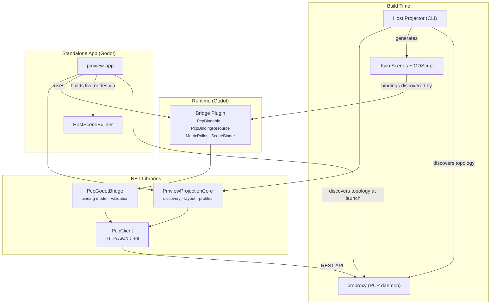
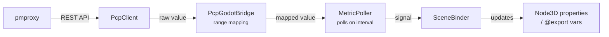

# Architecture

## Overview

`pmview-nextgen` supports three modes of operation: **CLI generation** (Host Projector discovers topology and writes `.tscn` files), **addon-in-editor** (bridge plugin runs inside any Godot project), and **standalone app** (pmview-app discovers topology at launch and builds live nodes). All three share the same PmviewProjectionCore library and bridge plugin.



## Layers

From scene surface down to the wire:

| Layer | Language | Tests | Purpose |
|-------|----------|-------|---------|
| **pmview-app** | C# (Godot.NET.Sdk) + GDScript | — | Standalone Godot app: runtime discovery, scene building, scene flow |
| **Host Projector** | C# (.NET 10.0) | xUnit | CLI tool: orchestrates scene emission and project scaffolding |
| **PmviewProjectionCore** | C# (.NET 8.0) | xUnit | Discovery, layout calculation, OS profiles — reusable by any consumer |
| **Scenes** | GDScript + .tscn | Godot runtime | Visual scenes with metric-driven properties |
| **Bridge Plugin** | C# (Godot.NET.Sdk) | gdUnit4 | MetricPoller, SceneBinder, PcpBindable, PcpBindingResource, editor inspector |
| **PcpGodotBridge** | C# (.NET 8.0) | xUnit | Binding model, validation, converter |
| **PcpClient** | C# (.NET 8.0) | xUnit | HTTP client for pmproxy REST API |

**Key design decisions:**

- PcpClient has zero Godot dependencies — pure .NET, fully xUnit testable
- PcpGodotBridge is also Godot-free: binding model and validation live here, maximising test surface
- PmviewProjectionCore is Godot-free: topology discovery, layout, and OS profiles live here so any consumer (CLI, standalone app) can reuse them
- The Bridge Plugin is the only Godot-dependent layer — kept thin by design
- Scenes are GDScript: lightweight controllers, no business logic
- **Three-mode model:** the same `SceneLayout` drives TscnWriter (CLI → `.tscn` text), the bridge addon (editor workflow), and HostSceneBuilder (standalone app → live nodes). HostSceneBuilder's `BuildZones()` / `AddHostViewUi()` split allows the fleet view to reuse the build pipeline for lightweight preview nodes

### PmviewProjectionCore

Extracted from Host Projector to allow multiple consumers (the CLI and the standalone app) to share topology discovery, layout calculation, and OS-specific profile logic without duplicating code.

**Contents:**

| Namespace | Responsibility |
|-----------|---------------|
| `Discovery` | `MetricDiscovery` — queries pmproxy for available metrics and builds a `HostTopology` |
| `Models` | `HostTopology`, `HostOs`, `SceneLayout`, `PlacedZone`, `PlacedShape`, `PlacedStack`, `ZoneDefinition`, `MetricShapeMapping`, `Vec3`, `RgbColour`, and supporting enums |
| `Layout` | `LayoutCalculator` — turns a topology + zone definitions into a positioned `SceneLayout` |
| `Profiles` | `IHostProfileProvider`, `HostProfileProvider`, `LinuxProfile`, `MacOsProfile`, `SharedZones` — OS-aware zone and metric-shape mappings |

**Dependencies:** PcpClient only (pure .NET 8.0, no Godot).

Host Projector now depends on PmviewProjectionCore and retains only `Emission/` (scene file writing) and `Scaffolding/` (Godot project bootstrap).

### pmview-app (Standalone Application)

A self-contained Godot application that performs topology discovery and scene building at runtime — no CLI step, no pre-generated `.tscn` files. The user launches the app, enters a pmproxy endpoint, and gets a live 3D host view.

**Scene flow:** main menu → loading → host view, *or* main menu → fleet view → (dive-in) → host view

| Scene | Controller | Role |
|-------|-----------|------|
| `main_menu.tscn` | `MainMenuController.gd` | Connection form (endpoint URL), animated 3D title, KITT scanner launch button |
| `loading.tscn` | `LoadingController.gd` + `LoadingPipeline.cs` | Six-phase pipeline: connect → topology → instances → profile → layout → build. Each phase materialises a letter of P-M-V-I-E-W. Supports `ZonesOnly` mode for fleet preview (builds zones without UI chrome) |
| `host_view.tscn` | `HostViewController.gd` | Receives the built `Node3D` tree, reparents it, wires MetricPoller → SceneBinder, handles ESC navigation |
| `fleet_view.tscn` | `FleetViewController.gd` | Fleet grid of compact hosts with patrol/focus cameras and preview pipeline (see Fleet View Architecture below) |

A `SceneManager` autoload singleton carries data between scenes (connection config, built scene graph).

**HostSceneBuilder vs TscnWriter:**

Both consume the same `SceneLayout` from PmviewProjectionCore. They produce the exact same node hierarchy, but through different mechanisms:

- **TscnWriter** (Host Projector CLI) serialises the layout to `.tscn` text files on disk. Godot loads these at editor or runtime. This is the offline/batch path.
- **HostSceneBuilder** (pmview-app) instantiates live Godot `Node3D`, `MeshInstance3D`, `Label3D` nodes in-process, loading packed scenes for building blocks and attaching scripts/bindings programmatically. This is the online/interactive path.

The structural equivalence means SceneBinder works identically regardless of which builder created the tree.

**HostSceneBuilder split — `BuildZones()` + `AddHostViewUi()`:**

`HostSceneBuilder.Build()` delegates to two composable methods:

- **`BuildZones(layout, endpoint, ...)`** — creates a `Node3D` with MetricPoller, SceneBinder, all metric zones, and ambient labels, but *no* controller script or UI panels. The returned tree is a self-contained, read-only visualisation suitable for embedding (e.g. as a fleet preview).
- **`AddHostViewUi(zonesRoot, mode)`** — attaches the `host_view_controller.gd` script, renames the root to "HostView", and adds UI panels (range tuning, help, detail) and optionally TimeControl (archive mode).

This split enables the fleet view to reuse the full discovery → layout → build pipeline but stop short of adding interactive chrome, producing lightweight preview nodes that can be arranged in a grid.

**Dependencies:** PmviewProjectionCore (discovery, layout, profiles) + bridge addon (building blocks, MetricPoller, SceneBinder, PcpBindable). PcpClient is used directly by LoadingPipeline for the discovery connection and transitively via the addon's MetricPoller for live polling.

## Runtime Data Flow



## Project Structure

```
pmview-nextgen/
├── pmview-nextgen.sln                  # Root solution (all .NET projects)
├── src/
│   ├── pcp-client-dotnet/              # PcpClient library
│   │   ├── src/PcpClient/
│   │   └── tests/PcpClient.Tests/
│   ├── pcp-godot-bridge/               # PcpGodotBridge library
│   │   ├── src/PcpGodotBridge/
│   │   └── tests/PcpGodotBridge.Tests/
│   ├── pmview-projection-core/         # PmviewProjectionCore library
│   │   ├── src/PmviewProjectionCore/
│   │   └── tests/PmviewProjectionCore.Tests/
│   ├── pmview-host-projector/          # Host Projector CLI (emission + scaffolding)
│   │   ├── src/PmviewHostProjector/
│   │   └── tests/PmviewHostProjector.Tests/
│   ├── pmview-app/                     # Standalone Godot application
│   │   ├── addons/pmview-bridge/       # Bridge addon (copied from pmview-bridge-addon)
│   │   ├── scenes/                     # main_menu, loading, host_view, fleet_view
│   │   ├── scripts/                    # GDScript controllers + HostSceneBuilder.cs
│   │   └── pmview-app.csproj
│   └── pmview-bridge-addon/            # Addon development workspace (Godot project)
│       ├── addons/pmview-bridge/       # Self-contained addon (copied to target projects)
│       │   ├── *.cs                    # Bridge plugin source
│       │   └── building_blocks/        # GroundedBar/Cylinder, GridLayout3D, ZoneLabel
│       ├── test/                       # gdUnit4 tests
│       ├── pmview-nextgen.csproj
│       └── pmview-nextgen.sln
├── dev-environment/                    # Docker compose: PCP + pmproxy + synthetic data
├── specs/                              # Feature specifications
└── docs/                              # Design documents and plans
```

## Fleet View Architecture

The fleet view displays multiple hosts in a single scene, each represented as a compact 3D tile in an auto-sized grid. Users patrol the grid, focus on individual hosts to see a live preview, and optionally dive into a full HostView.

### Scene Components

| Component | Script | Role |
|-----------|--------|------|
| `FleetViewController` | `FleetViewController.gd` | Top-level orchestrator: builds grid, manages cameras, handles input |
| `CompactHost` | `compact_host.gd` | Individual host tile with summary metric bars |
| `FleetHostPipeline` | `fleet_host_pipeline.gd` | Per-host coordinator: wraps LoadingPipeline with ZonesOnly mode |
| `MatrixProgressGrid` | `matrix_progress_grid.gd` | Shader-driven 10x10 cell grid that fills as pipeline phases complete |
| `HolographicBeam` | `holographic_beam.gd` | Visual connector between compact host and elevated preview |
| `PatrolCamera` | `patrol_camera.gd` | Racetrack orbit camera for the fleet grid overview |
| `FocusCamera` | `fly_orbit_camera.gd` | Orbit camera centred on the focused host's preview |

### Fleet Preview Pipeline

When a user selects a host, the focus flow runs a lightweight version of the standard loading pipeline to build a zones-only preview:

```
FleetViewController._enter_focus(host_index)
  └─ FleetHostPipeline.start(endpoint, mode, hostname, matrix_grid)
       └─ LoadingPipeline { ZonesOnly = true, MinPhaseDelayMs = 0 }
            ├─ Phase 0-4: connect → topology → instances → profile → layout
            │   (each phase fills cells in the MatrixProgressGrid)
            └─ Phase 5: HostSceneBuilder.BuildZones(layout, ...)
                         → Node3D with zones + MetricPoller + SceneBinder
                         → no controller script, no UI panels
```

The built zones node is positioned above the compact host (elevated by a holographic beam) and immediately starts receiving live metric data via its own MetricPoller.

### Camera Modes and Transitions

| Mode | Camera | Behaviour |
|------|--------|-----------|
| **Patrol** | `PatrolCamera` | Racetrack orbit around the full grid |
| **Transitioning to Focus** | `PatrolCamera` | Fly-to animation towards the selected host's orbit position |
| **Focus** | `FocusCamera` | Orbit around the elevated preview; Enter/double-click to dive in |
| **Transitioning to Patrol** | `PatrolCamera` | Fly-out to nearest racetrack point, then resume patrol |

### Dive-In Transition (Fleet → HostView)

When the user presses Enter or double-clicks in focus mode with a ready preview:

1. The zones `Node3D` is detached from the fleet scene tree (not freed)
2. `SceneManager.go_to_host_view_from_fleet(zones, hostname)` stores the zones and sets `origin_scene = "fleet"` and `fleet_focused_hostname`
3. The host view scene receives the pre-built zones, calls `HostSceneBuilder.AddHostViewUi()` to attach the controller script and UI panels, then proceeds as a normal HostView
4. The preview's MetricPoller is already connected and polling — no second discovery pipeline runs

### ESC Navigation Hierarchy

ESC behaviour varies by context, creating a layered navigation stack:

```
HostView (from fleet)
  └─ ESC → Fleet View (focus restored on the same host)
              └─ ESC → Fleet Patrol
                          └─ ESC ESC (double-press within 2s) → Main Menu

HostView (direct launch)
  └─ ESC → Main Menu
```

Within HostView itself, ESC is contextual: it first dismisses the help panel, then deselects a focused shape, then exits a saved viewpoint, before finally navigating back.

## Further Reading

- [docs/BINDINGS.md](BINDINGS.md) — binding system deep-dive
- [docs/HOST-PROJECTOR.md](HOST-PROJECTOR.md) — scene generator reference
- [docs/plans/](plans/) — design documents and architecture decisions
