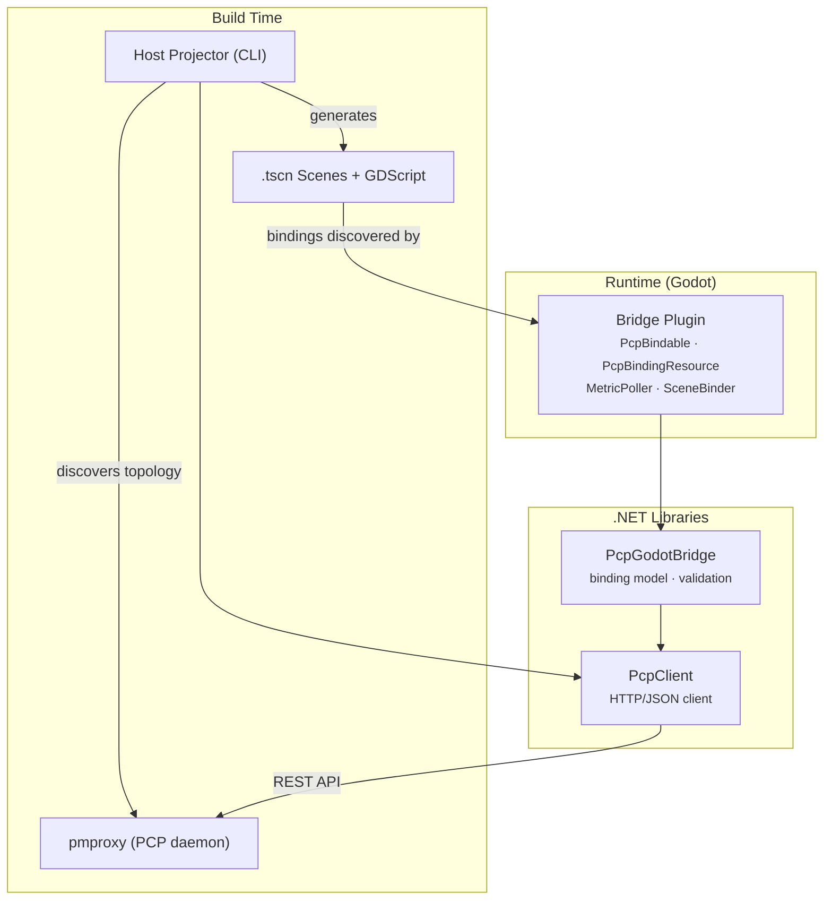
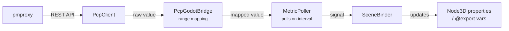

# Architecture

## Overview

`pmview-nextgen` has two distinct phases: **build time** (topology discovery + scene generation) and **runtime** (Godot running the generated scene with live metric updates).



## Layers

From scene surface down to the wire:

| Layer | Language | Tests | Purpose |
|-------|----------|-------|---------|
| **Host Projector** | C# (.NET 8.0) | xUnit | CLI tool: discovers host topology from pmproxy, generates .tscn scenes |
| **Scenes** | GDScript + .tscn | Godot runtime | Visual scenes with metric-driven properties |
| **Bridge Plugin** | C# (Godot.NET.Sdk) | gdUnit4 | MetricPoller, SceneBinder, PcpBindable, PcpBindingResource, editor inspector |
| **PcpGodotBridge** | C# (.NET 8.0) | xUnit | Binding model, validation, converter |
| **PcpClient** | C# (.NET 8.0) | xUnit | HTTP client for pmproxy REST API |

**Key design decisions:**

- PcpClient has zero Godot dependencies — pure .NET, fully xUnit testable
- PcpGodotBridge is also Godot-free: binding model and validation live here, maximising test surface
- The Bridge Plugin is the only Godot-dependent layer — kept thin by design
- Scenes are GDScript: lightweight controllers, no business logic

## Runtime Data Flow



## Project Structure

```
pmview-nextgen/
├── pmview-nextgen.sln                  # Root solution (all .NET projects)
├── src/
│   ├── pcp-client-dotnet/              # PcpClient library
│   │   ├── src/PcpClient/
│   │   └── tests/PcpClient.Tests/
│   ├── pcp-godot-bridge/               # PcpGodotBridge library
│   │   ├── src/PcpGodotBridge/
│   │   └── tests/PcpGodotBridge.Tests/
│   └── pmview-host-projector/          # Host Projector CLI
│       ├── src/PmviewHostProjector/
│       └── tests/PmviewHostProjector.Tests/
│   └── pmview-bridge-addon/            # Addon development workspace (Godot project)
│       ├── addons/pmview-bridge/       # Self-contained addon (copied to target projects)
│       │   ├── *.cs                    # Bridge plugin source
│       │   └── building_blocks/        # GroundedBar/Cylinder, GridLayout3D, ZoneLabel
│       ├── test/                       # gdUnit4 tests
│       ├── pmview-nextgen.csproj
│       └── pmview-nextgen.sln
├── dev-environment/                    # Docker compose: PCP + pmproxy + synthetic data
├── specs/                              # Feature specifications
└── docs/                              # Design documents and plans
```

## Further Reading

- [docs/BINDINGS.md](BINDINGS.md) — binding system deep-dive
- [docs/HOST-PROJECTOR.md](HOST-PROJECTOR.md) — scene generator reference
- [docs/plans/](plans/) — design documents and architecture decisions
